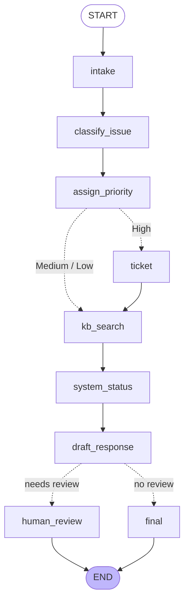

# SAP Support Agent -- LangGraph + Google Gemini

An agentic support desk for SAP issues. One user complaint goes in; a triaged,
grounded, optionally escalated support response comes out.

The full exercise brief is in [PROBLEM_STATEMENT.md](PROBLEM_STATEMENT.md); this file is
the write-up, in the submission order from section 13.

## 1. Problem solved

An SAP support team receives free-text issues spanning BTP, Integration Suite/CPI,
SuccessFactors, S/4HANA and HANA Cloud. The agent classifies the issue, decides its
priority, raises a ticket when production is affected, pulls matching troubleshooting
articles, checks the systems named in the issue, drafts a technical answer, and routes
High-priority answers through a human before they are sent.

## 2. Graph diagram



Regenerate it from the compiled graph at any time:

```bash
python -c "import support_agent; support_agent.print_graph()"
```

## 3. State schema

[support_agent.py:74](support_agent.py#L74) -- every node receives this dict and returns
only the keys it changes.

| Key | Written by | Purpose |
| --- | --- | --- |
| `user_issue` | intake | Whitespace-normalised issue text |
| `category` | classify_issue | One of the seven SAP areas |
| `priority` | assign_priority | High / Medium / Low |
| `kb_result` | kb_search | Matching knowledge base articles |
| `system_status` | system_status | Availability of every system named |
| `draft_response` | draft_response | Gemini's answer, pre-approval |
| `final_response` | human_review / final | What actually gets sent |
| `ticket_id` | ticket | Set only on the High branch |
| `needs_human_review` | assign_priority | Drives the second conditional edge |
| `history` | intake | `Annotated[List[str], operator.add]` -- **accumulates** |

`history` is the one key with a reducer. Everything else is overwritten on write; a
reducer key is merged instead, so a thread that handles three issues ends up with all
three, which is what makes the memory demo work.

## 4. Node descriptions

| Node | Does | Uses |
| --- | --- | --- |
| `intake` | Normalises whitespace, records the issue in `history` | -- |
| `classify_issue` | Picks one of the seven categories | Gemini, structured output |
| `assign_priority` | High/Medium/Low, and flags escalation | Gemini, structured output |
| `ticket` | Raises an incident (High branch only) | `create_support_ticket` |
| `kb_search` | Finds troubleshooting articles | `search_kb` |
| `system_status` | Checks each system named in the issue | `detect_systems`, `check_system_status` |
| `draft_response` | Writes the answer from the gathered facts | Gemini |
| `human_review` | Approve or reject the draft | approval callback |
| `final` | Ships the draft unchanged (Medium/Low) | -- |

Both LLM decisions use `with_structured_output` against a Pydantic model with `Literal`
fields, so `category` and `priority` can only ever be values the router understands --
no string parsing, no "High priority" vs "High" mismatch breaking an edge.

## 5. Tool descriptions

[sap_tools.py](sap_tools.py)

| Tool | Returns |
| --- | --- |
| `search_kb(query)` | Up to 3 articles, ranked by how many trigger words the query hits |
| `check_system_status(system)` | `"CPI = Running"`, resolving aliases like `s/4hana`, `cloud integration` |
| `create_support_ticket(summary, priority)` | `INC-20260721-P1-001` |

Matching is whole-word (`\bhana\b`), not substring. That distinction is load-bearing:
with plain `in` checks, *"Production S/4HANA order creation API is down"* also matched the
HANA Cloud article, and *"Salesforce"* resolved to SuccessFactors via the `sf` alias.

All three are also exported as LangChain tools (`SAP_TOOLS`) for the `ToolNode` challenge.

## 6. Code

```
sap_tools.py       KB, mock landscape, the three tools
support_agent.py   state, nodes, routers, graph, memory, reporting
run_demo.py        the four test cases + a memory walkthrough
test_routing.py    graph wiring checks, no API key needed
```

### Setup

```bash
cd sap-support-agent-langgraph
python -m venv .venv
.venv\Scripts\activate            # Windows;  source .venv/bin/activate elsewhere
pip install -r requirements.txt
copy .env.example .env            # then paste your key from aistudio.google.com/apikey
```

### Run

```bash
python test_routing.py                       # verify the graph offline, no key needed
python run_demo.py                           # all four test cases
python run_demo.py --ask                     # approve each escalation yourself
python support_agent.py "HANA Cloud is unreachable from my CAP app"
```

`human_review` calls `input()` only when a console is attached, and treats an `EOFError`
as approval — some sandboxes report stdin as a terminal but have nothing to read, and
without that catch the whole graph dies at the review step. So from a script, a
scheduler or a headless notebook it auto-approves instead of crashing or hanging, and
`set_approver(fn)` swaps in any decision function -- that is how `run_demo.py` runs
unattended and how `test_routing.py` tests a rejection. It is a module setting rather
than a graph config value because a callable cannot be serialised into a checkpoint.

## 7. Test case outputs

`python test_routing.py` asserts the routing for all four cases from section 10 with the
LLM stubbed out, so the graph can be checked without spending a call:

```
ok  High   ticket=True  review=True  SAP CPI integration from SuccessFactors to S/4...
ok  Low    ticket=False review=False How can I create a destination in SAP BTP cock...
ok  Medium ticket=False review=False SAP HANA Cloud connection is failing from CAP ...
ok  High   ticket=True  review=True  Production S/4HANA order creation API is down ...
ok  a rejected review replaces the draft with a revision request
ok  history accumulates per thread_id
```

`python run_demo.py` runs the same four against Gemini and prints the full response.
Category and priority come from the model there, so treat the expected values as the
target, not a guarantee -- a disagreement is a prompt to sharpen the rules in
`PRIORITY_PROMPT`.

## 8. What you learned

- **State is the contract.** Nodes never call each other; they read and write one dict.
  Adding `system_status` needed no change to any other node.
- **Reducers are the only way to accumulate.** Without `operator.add` on `history`, each
  run would overwrite the last and the memory demo would show one entry.
- **Conditional edges belong to the router, not the node.** `assign_priority` decides a
  priority; `route_after_priority` decides where that priority goes. Keeping them apart
  means the routing can be tested with a stubbed LLM.
- **Checkpointing is per `thread_id`.** Same graph, two threads, two independent
  histories -- the checkpointer is what turns a one-shot workflow into a conversation.
- **Constrain the LLM where the graph depends on it.** `Literal` types on structured
  output remove a whole class of routing bug.

## 9. Improvements possible

- Ticket creation runs *before* the KB search, per the brief's flow, so the ticket
  summary cannot include the suggested fix. Moving `ticket` after `draft_response` would
  file a far more useful incident.
- A rejected review currently ends the graph. An edge back to `draft_response` carrying
  the reviewer's comment would make it a real revision loop.
- Swap `human_review` for LangGraph's `interrupt()` so the graph genuinely pauses and
  resumes from the checkpoint, instead of blocking a thread on `input()`.
- Replace the keyword KB with embeddings over real SAP notes -- the sibling project
  `sap-incident-knowledge-assistant16july` already has that retrieval stack.
- Let Gemini choose the tools via `ToolNode` + `tools_condition` rather than fixed nodes,
  and split the workflow into classifier / resolver / escalation / writer agents.
- Point `create_support_ticket` at the real Jira API, and swap Gemini for SAP AI Core.
